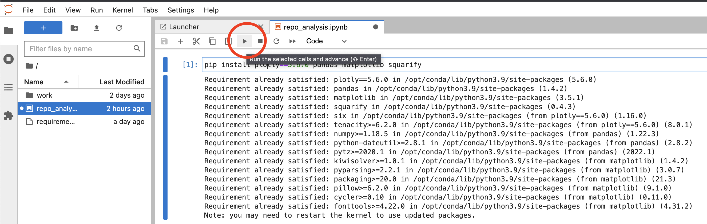
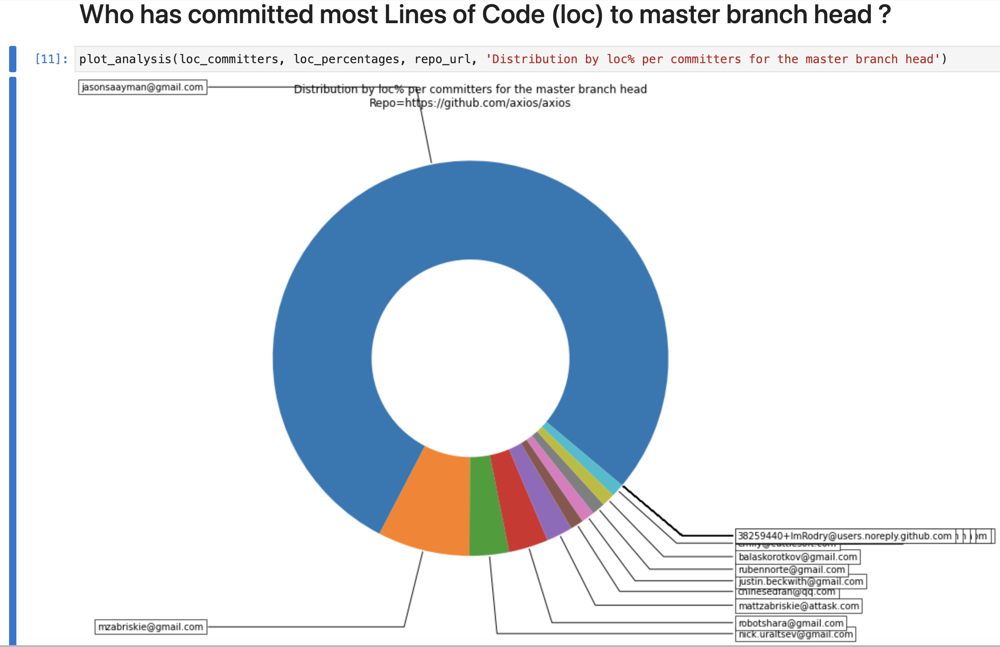
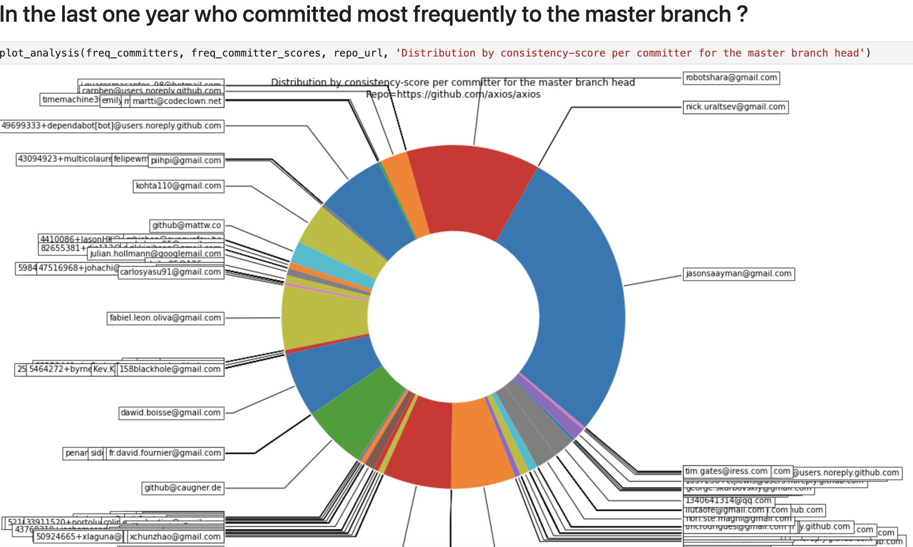
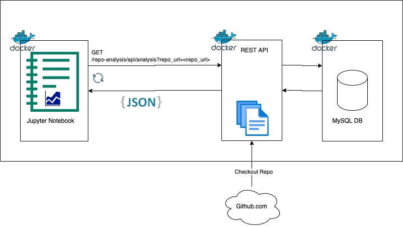

# committer-classification
Copyright (C) 2022 Himanshu Vijay

## What is this project ?
This is a REST API which can generate some committer related stats 
for any given github.com repo. 

### Pre-requisites
* Python3
* pipenv
* Docker
* Docker compose if not installed: 
  * check: `docker compose --help`
  * https://docs.docker.com/compose/install/

### Running locally
* Ports 80, 8888, 8080 need to be free. 
  * If they aren't change the *left* hand side port(s) in [docker-compose.yml](docker-compose.yml) 
    on lines 15, 22, 39. Eg. If your port 80 isn't free then change 
    line 22 to something like `9000:80`
* `make run`
  * Note: It may take up to 5 mins the first time.
  * Wait for about a minute. The REST API is the last one to start.
```
$ make run
. ./run.sh && run_api

Use 'docker scan' to run Snyk tests against images to find vulnerabilities and learn how to fix them
[+] Running 5/5
 ⠿ Network committer-classification_default  Created                                                                                                                                 0.1s
 ⠿ Container repo-analysis-db                Healthy                                                                                                                                 3.2s
 ⠿ Container repo-analysis-db-admin-console  Healthy                                                                                                                                 3.0s
 ⠿ Container repo-analysis-rest-api          Healthy                                                                                                                                 3.0s
 ⠿ Container repo-analysis-notebook          Healthy                                                                                                                                17.8s
DB admin console started
REST API started
Jupyter Notebook started
DB Admin Console: http://localhost:8080/?server=db&username=root&db=repo_analysis
REST API Swagger: http://localhost:80/repo-analysis/api/docs
Jupyter Notebook: http://127.0.0.1:8888/lab?token=notoken 
```
* Checking things:
  * All urls are printed after the run command.
  * REST API: http://localhost/repo-analysis/api/docs
  * DB admin console: http://localhost:8080/?server=db&username=root&db=repo_analysis
    * password=DB_PASSWORD in [local.env](local.env) file.
  * Jupyter Notebook: execute each cell to see how API works. Try some sample repos from [here](https://github.com/search?q=stars%3A%22%3E+100%22+size%3A%3C5000&type=Repositories&ref=advsearch&l=&l=).
  It can analyze any repo however the popular ones like Apache Kafka take 10+ minutes.
  * For checking logs: `make logs` (Ctrl+C to exit tailing the logs.)
    







### Cleanup    
* `make stop`  

## How does it work ?
The REST API pulls down the git repo from github.com,
runs some git commands to get commit related data, then generates some 
stats from which it tries to come up with a score per committer.
Jupyter Notebook is used to visualize the stats. MySQL is used to store 
data. All components are docker containers.

All the caller needs to do is keep calling the API (like every 5-10 seconds)
with the URL http://localhost/repo-analysis/api/analysis?repo_url=<repo_url>
until it returns data.



### Why I chose this project ?
1. It sort of aligns with the Dreamteam product. Vision is to gather metrics
that can even give some loose idea about: 
   * Who's contributed most code (in production) to a project ?
   * Who commits more consistently and frequently ? (i.e. follows code commit best practices)
   * Whose PRs generally have less turn around time ? (Gives a hint of the same as above.)
   * Who's most active in discussions ? This may not be most code contributor!
   * Who generally gives most constructive PR feedback/comments ?  
2. It demonstrates my experience with writing REST APIs.

### Limitations
1. Only analyzes last one year of commits.
2. Need to remove outlier data eg. imagine if someone did only two commits 
   in a year, but the commits were within two hours of each other. 
   The current calculation will still give them a very high consistency 
   score.
3. Currently results are cached in DB forever. They'll need to be 
   recomputed when more commits have happened on a repo.   

### TODOs for production readiness
1. Add many more unit, api and integration *tests*.
2. Add *infrastructure-as-code* for cloud based deployment eg. 
   terraform logic, AWS CDK.
3. Add *monitoring* and *alerting*.
4. Add *authentication* to the REST API. All other security eg. for DB.
5. Preferably create a HTML UI for visualization.
6. Break the system down into more components to better scalability.
    * Break out each kind of analysis (loc, commit frequency) into a 
    separate pipeline.
    * Most likely a queuing mechanism (like SQS) will be needed instead
  of an in-memory data structure.
7. *Code refactoring* to break it further into more classes. More modularization and 
   organization needed.
8. Add support for multiple environments like `dev`, `qa`, `pre-prod`, `prod`.
9. Try to use Github REST APIs instead of git commands so that don't need to 
   checkout the repo. However that'll work for only github repos whereas the
   current implementation can be adapted for enterprise use as well.